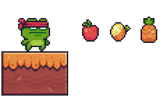

## Piksel Bros.

Just a platformer I irregularly update for fun :)

### How do I run this game?

1. `make run` to install dependencies and run the game.

2. `make debug` to run with hitboxes and debug info.

3. `make edit` to initialize the map editor.

### Contributing?

Feel free to fork and submit PR!  
Here's a list of ["things"](https://github.com/eesuhn/piksel-bros/issues) sitting on the shelf.
